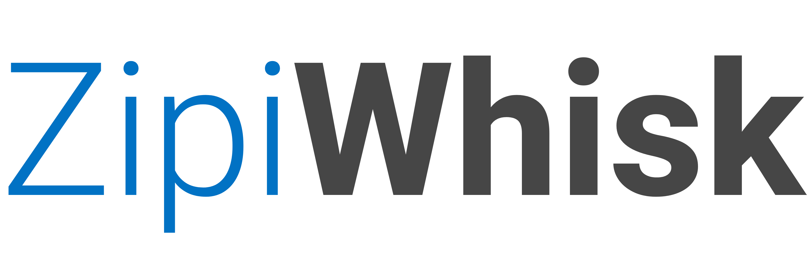
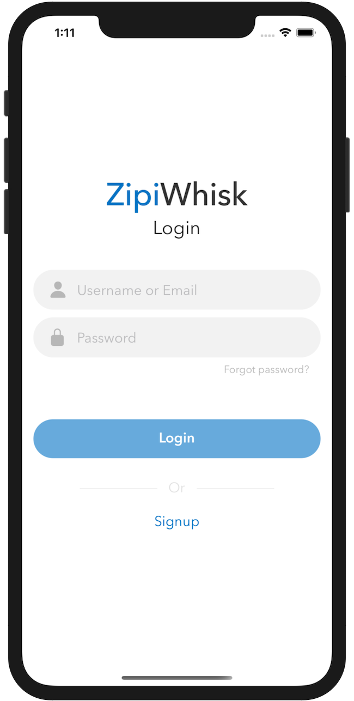
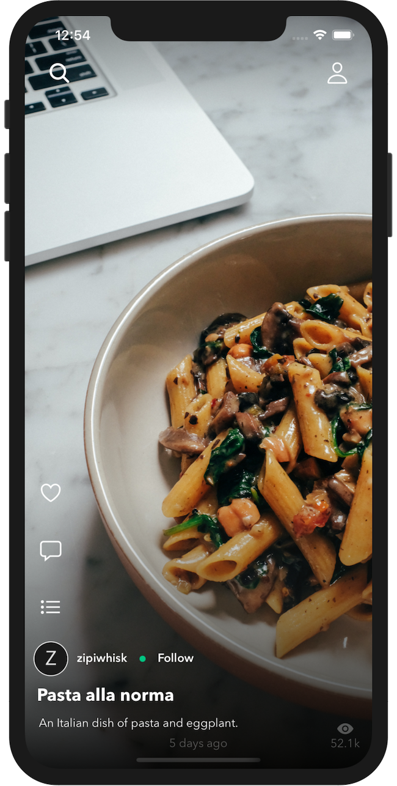
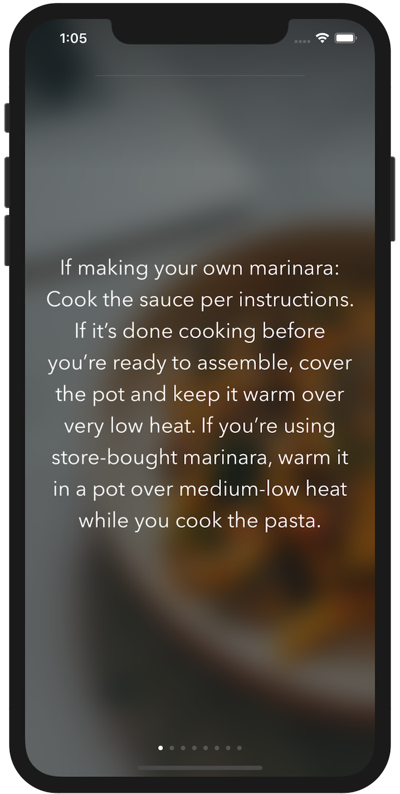

<!-- PROJECT LOGO -->
 

 
  

  A sleek and easy-to-use app where you can create and explore delicious recipes!  
  

<!-- ABOUT THE PROJECT -->

## About The Project

This app started as a small project to learn the fundamentals of a full-stack application. It quickly grew into something much greater than that. Zipiwhisk is a recipe app where users can explore recipes without the fluff. It helps you find the tasty recipes you're looking for in a simple and easy-to-use format.

What makes it so cool?

- Simplicity has been the underlying factor behind all the decisions when creating the UX/UI.
- "We eat first with our eyes"; that's why photos & videos are a crucial part of why this app is so great.
- Adding a social aspect to the app was almost necessary to help bring more fun and excitement to the recipes you make!

I hope this app helps people build a better relationship with food and explore new cuisines, but more importantly, I hope it brings more awareness to the food they are consuming.

### Built With

- [React Native](https://reactnative.dev/)
- [Redux](https://redux.js.org/)
- [Node.js](https://nodejs.org/)
- [Express](https://expressjs.com/)
- [MySQL](https://www.mysql.com/)
- [Expo](https://docs.expo.dev/)

<!-- CONTACT -->

## Contact

Mike Bilyeu - mikebilyeu512@gmail.com

Project Link: [https://github.com/MikeBilyeu/zipiwhiskMobile](https://github.com/MikeBilyeu/zipiwhiskMobile)
